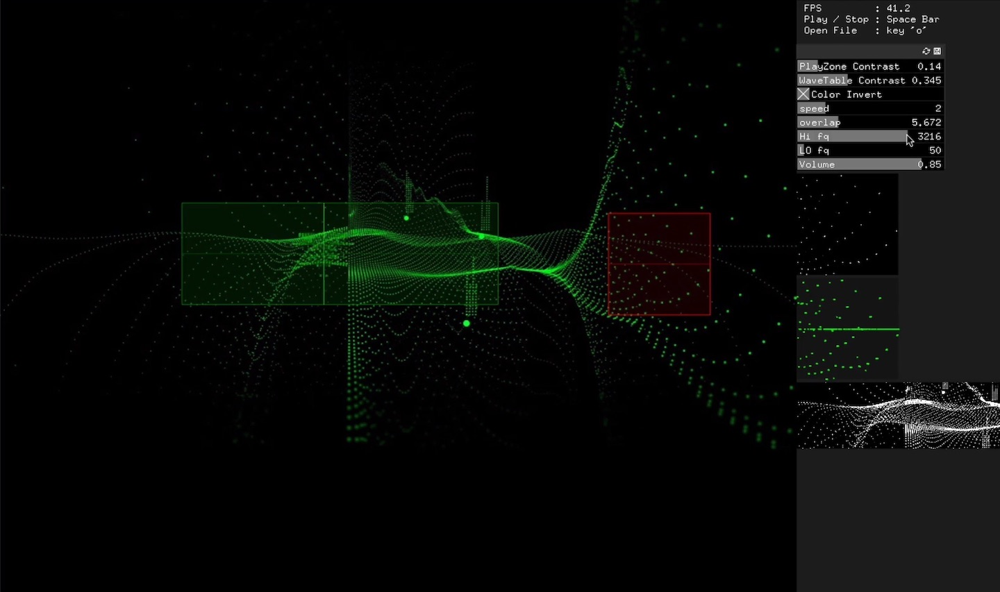
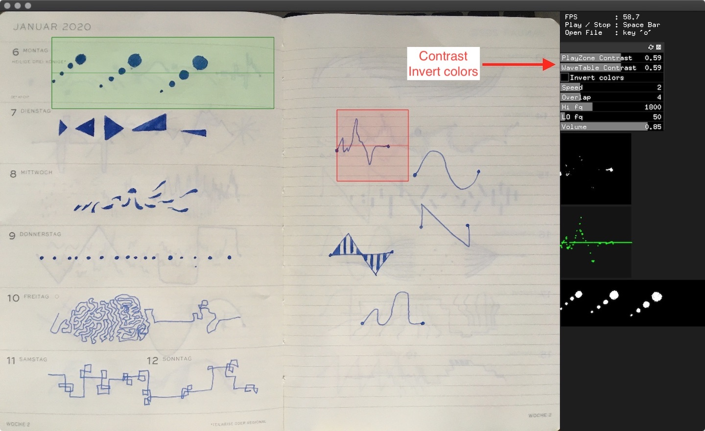
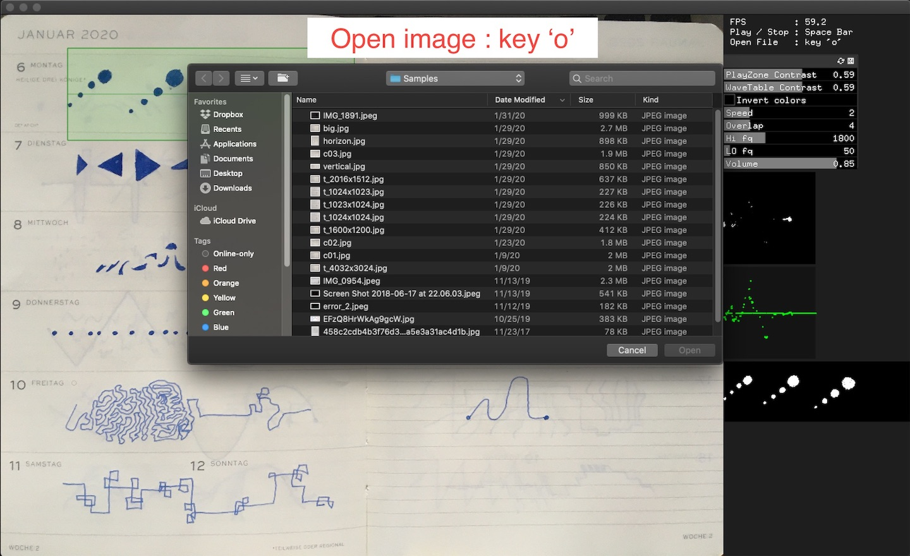

# Sketch Synth
         

         

         

		

## Short description
This is an experimental test app. It works like the UPIC of Iannis Xenakis or synthesizes images as sound. In particular, this application uses hand-drawn sketches to convert music and synthesizers.		

- First, load a hand-drawn image (jpg or png, key : 'o')      
- Moving and set up a position of the red wavetable zone and the green play zone      
- Change the contrast parameters of the selected area      
- Playing and stopping is by spacebar      
- Optional parameters are speed, frequency, overlap      

A hand-drawn sketch image should be on the white background. If the background of the image is darker than a sketch, the 'Invert colors' option creates a better play and wavetable area.

There will be more features and updates.

## Support
<link href="https://fonts.googleapis.com/css?family=Arial" rel="stylesheet"><a class="bmc-button" target="_blank" href="https://www.buymeacoffee.com/c4KbpP0oa">Buy me a coffee</a>

## Links
<b>v0.0.1 Download (Mac OS Catalina - 10.15.3)</b> : [SketchSynth_Simple.app.zip](https://github.com/jeonghopark/SketchSynth-Simple/releases/download/v0.0.1/SketchSynth_Simple.app.zip)				

<b>v0.0.1 Download (Windows 10)</b> : [SketchSynth_Simple-Win.zip](https://github.com/jeonghopark/SketchSynth-Simple/releases/download/v0.0.1/SketchSynth_Simple-Win.zip)				

<b>Sourcecode</b> : [https://github.com/jeonghopark/SketchSynth-Simple](https://github.com/jeonghopark/SketchSynth-Simple)         
!!! I'm an artist working with code. Not a real programmer. Maybe the source code is unusual. But it works. :-).            

Website : <a target="_blank" href="https://jeonghopark.de/sketchsynth">https://jeonghopark.de/sketchsynth</a>

It's made with openFrameworks C++ framework. - <a target="_blank" href="https://openframeworks.cc">https://openframeworks.cc</a>

## Upcoming features
- Changeable a size of the play zone and the wavetable zone			
- Improve sound quality			
- Node-style play function      		 	
- User interface			
- Support Windows 10					
		
## Contact		
Mail: jeonghopark (at) jeonghopark.de             
<a target="_blank" href="https://jeonghopark.de">https://jeonghopark.de</a>             
©2020 JeongHo Park             
